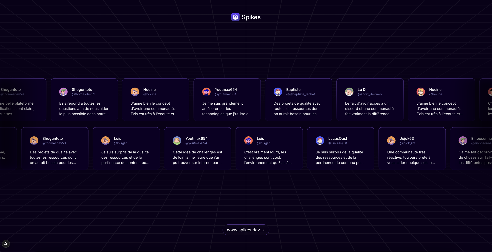

# Projet Spike - Marquee

## Projet à intégrer



## Explications

Le projet **Spike** est un exercice d'intégration visant à reproduire une **landing page** en se basant sur une maquette Figma.

L'un des éléments clés de ce projet est l'utilisation d'un **défilement en marquee** pour un effet dynamique.

## Technologies

- Next.js / React
- TypeScript
- TailwindCSS

## Fonctionnalités

- Défilement marquee fluide
- Optimisation des performances

## 🔗 Lien du projet

Vercel : [Lien du projet en ligne](https://challenge01-marquee.vercel.app/)

## Installation en local

```sh
git clone git@github.com:NicolasJoubert/challenge01-marquee.git
cd projet-spike
npm install
npm run dev
```
